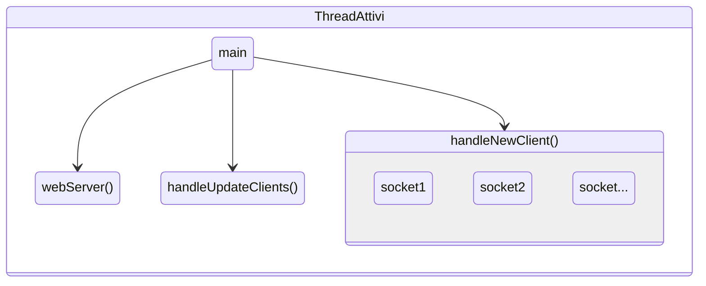
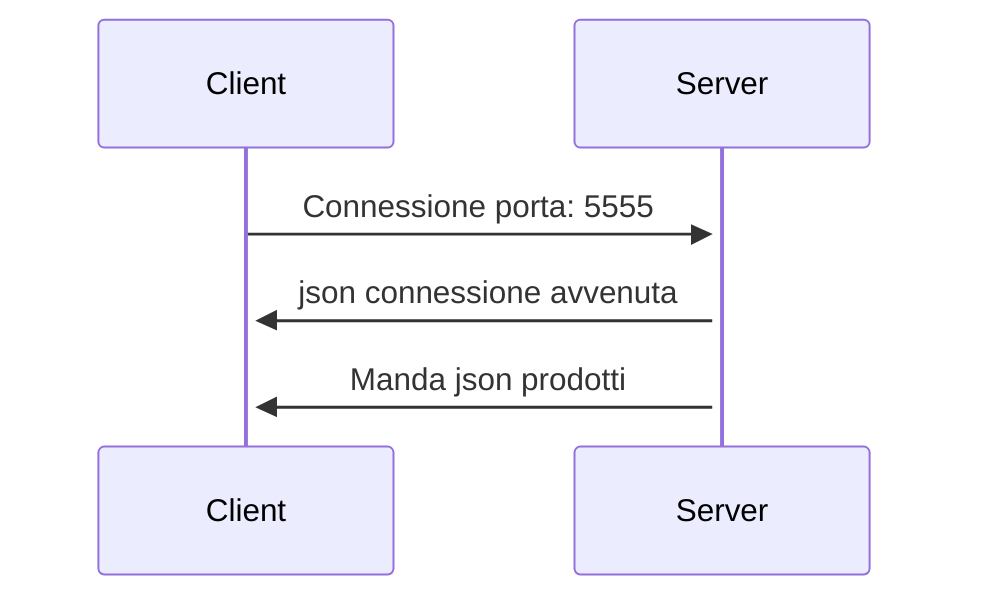
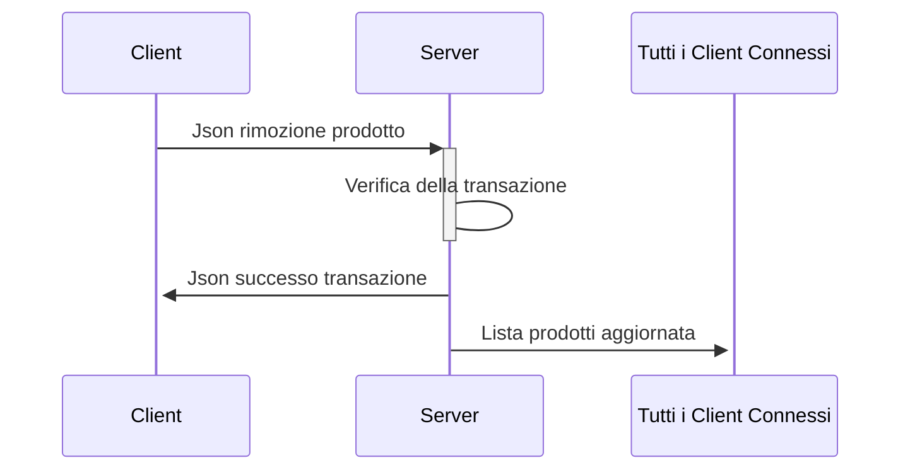

# Progetto per reti di calcolatori
Creato da:
- [Teshale Cella](https://github.com/TTTT-san)
- [Luca Ilari](https://github.com/Luca-Ilari)
# Introduzione
Il progetto consiste in un server che gestisce parallamente le connessioni e le richieste dei client. Il server ha una lista di prodotti caricati da un file .csv nella cartella del server che possono essere "acquistati" e "rimborsati" dai client connessi.
# Installazione e utilizzo
### Server
Scaricare l'ultima versione del server per il proprio sistema operativo da questa pagina [release](https://github.com/Luca-Ilari/Progetto-Reti-di-calcolatori/releases)

Una volta scaricato decomprimere l'archivio.

Esempio con linux: 
```
./Server-Linux 5555 8080
```

Se su mac o linux utilizzano questo comando il server non parte rendere il server un eseguibile con il comando:
```
Mac:
chmod +x ServerMacOs
Linux:
chmod +x ServerLinux
```

### Client
Scaricare l'ultima versione del `Client.jar` da questa pagina [release](https://github.com/Luca-Ilari/Progetto-Reti-di-calcolatori/releases) e avviarlo utilizando java.

Se su mac il client non parte, utilizzare da terminale il comando 
```
java -jar Client.jar
```

# Caratteristiche Server
Il server è un'applicazione da linea di comando scritta interamente in C. Utilizza thread, semafori e critical section per funzionare e gestire contemporaneamente tutti i client.

Quando viene eseguito da linea di comando bisogna specificare la porta su cui il server ascolta nuove connessioni dai client e una porta per il webserver.

Se il primo parametro non è specificato il server non si avvia, invece non specificando il secondo parametro il server non lancerà il webserver.
Lanciando il server così `./Server-Linux 5555 8080` i client potranno connettersi alla porta 5555. Invece utilizzando un browser all'indirizzo [localhost:8080](http://localhost:8080) si potrà visuallizzare la pagina con lo stato del server.

Il server carica i prodotti dal file "products.csv" presente nella cartella compressa. In caso di eliminazione di questo file il server caricherà dei prodotti di default. Questo file contiene il nome, prezzo e quantità dei prodotti che il server gestisce.

File products.csv 
```csv
Pane,100000,2.99
Acqua,50000,1
Vino,50000,20
Birra,900,2
Patatine,7000,2
Pizza,90000,9.99
```

Oltre a gestire i client il server, gestisce anche un semplice webserver http sulla porta specificata all'avvio. Questo web server carica una pagina html presente nella cartella compressa che attraverso un semplice script js aggiorna ogni secondo il numero di client e prodotti che il server ha disponibile.


Qui di seguito, una rappresentazione grafica dei thread che il server utilizza per gestire i client, il webserver e aggiornare la lista dei prodotti quando viene modificata da un client

---

# Caratteristiche del Client

Il client è stato sviluppato in Java, utilizzando la libreria Swing per garantire un'interfaccia utente intuitiva e aderendo al pattern architetturale MVC (Model-View-Controller).

**Nota:** Prima di utilizzare le funzionalità, è necessario connettersi correttamente al server.

## Funzionalità Principali:

### Visualizzazione dei Prodotti
Dopo la connessione al server, l'utente può consultare i prodotti disponibili nel negozio attraverso la tabella "Prodotti Negozio".

### Modifica dei Parametri del Server
Per personalizzare la connessione, il client offre un pulsante "Impostazioni Server" che permette di regolare l'indirizzo IP e la porta del server.

### Creazione di Ordini
L'utente può effettuare acquisti o vendite utilizzando il pulsante "Compra e Vendi", facilitando la gestione degli ordini.

## Dettagli dell'Interfaccia Utente:

Nell'interfaccia utente sono presenti quattro tabelle:

1. **Prodotti Acquistati:** Situata nella parte superiore sinistra, questa tabella visualizza i prodotti acquistati dall'utente.

2. **Prodotti Disponibili:** Posizionata nella parte superiore destra, questa tabella elenca i prodotti attualmente disponibili nel negozio.

3. **Transazioni di Acquisto:** Posta nella parte inferiore sinistra, questa tabella riporta le transazioni di acquisto effettuate dall'utente.

4. **Transazioni di Vendita:** Situata nella parte inferiore destra, questa tabella mostra le transazioni di vendita eseguite dall'utente.
Certamente, ecco una revisione migliorata del testo:

## Interfaccia Utente - Gestione Acquisti e Vendite

Gli utenti possono navigare attraverso l'interfaccia per acquistare i prodotti disponibili nel negozio o vendere quelli già acquistati.

### Acquisto e Vendita di Prodotti:

1. **Selezione dell'Operazione:**
   - Utilizza il pulsante "Compra - Vendi" per avviare il processo di acquisto o vendita.
   - Si aprirà il modulo "Creazione Ordini" con le opzioni "Compra" e "Vendi".

2. **Acquisto:**
   - Seleziona l'opzione "Compra" nel modulo.
   - Specifica l'ID e il nome del prodotto oppure seleziona direttamente dalla tabella "Prodotti Negozio" il prodotto desiderato.
   - Inserisci la quantità desiderata per ogni transazione.
   - Specifica il numero totale di transazioni da effettuare.

3. **Vendita:**
   - Seleziona l'opzione "Vendi" nel modulo.
   - Inserisci il nome del prodotto che desideri vendere.
   - Inserisci la quantità desiderata per la vendita.
   - Specifica il numero totale di transazioni da effettuare.

4. **Invio delle Transazioni:**
   - Premi il pulsante "Invio" per avviare il processo di invio delle transazioni al server.
   - Una barra di progresso mostra la progressione delle transazioni inviate al server.

5. **Nota Importante:**
   - Prima di effettuare una vendita, assicurati di aver acquistato i prodotti desiderati, visibili nella tabella "Prodotti Acquistati".

Ecco una versione migliorata della struttura e del testo:

## Stati di Transazione
Questa sezione fornisce una panoramica degli stati possibili per le transazioni di acquisto o vendita e una breve descrizione del loro significato.

| Stato                  | Descrizione                                                            |
|------------------------|------------------------------------------------------------------------|
| In attesa              | Il server sta ancora elaborando la transazione.                         |
| Completata             | Transazione completata con successo.                                    |
| Errore Server          | Errore durante l'elaborazione della transazione lato server.            |
| Non disponibile        | Quantità richiesta non disponibile nel negozio.                         |
| Quantità insufficiente | La quantità richiesta supera la disponibilità del cliente.              |
| Max raggiunta          | Quantità massima prevista raggiunta.                                   |
| Min raggiunta          | Quantità minima prevista raggiunta.                                     |

--- 
# Descrizione di come il client e il server comunicano
Tutti i messaggi che il server e il client si scambiano sono in formato json con dentro un codice che identifica il tipo di messaggio che si sta mandando. Per dettagli ulteriori andare alla sezione [Json](#json-e-codici-di-stato).

I client una volta che sono connessi e hanno ricevuto la lista dei prodotti, possono iniziare ad inviare delle richieste  di "acquisto" al server; ovvero possono mandare una richiesta al server di decrementare un elemento specifico come se lo avessero acquistato.

Il server una volta ricevuta la richiesta verifica la sua validità e quindi decrementa il prodotto specificato dal client.

Ogni volta che un client connesso al server modifica la lista dei prodotti, il server manda la lista aggiornata a tutti i client connessi in modo da avere sempre i client aggiornati.

Se la richiesta non è valida, quindi per esempio il client chiede di rimuovere troppi prodotti rispetto a quelli che ci sono nella lista, il server risponde al client con un json con codiceStato -2.

## Esempi di come il client e il server comunicano
Connessione di un client al server sulla porta 5555

Modifica della lista prodotti da parte di un client


# JSON e codici di stato
| codiceStato | Descrizione |
| ----- | ------------- |
| 1 | START_SESSION |
| 2 | RIMUOVI_PRODOTTO |
| 3 | AGGIUNGI_PRODOTTO |
| 4 | LISTA_PRODOTTI_AGGIORNATO |
| 5 | SUCCESSO_TRANSAZIONE_ACQUISTO |
| 6 | SUCCESSO_TRANSAZIONE_VENDITA |
| -1 | FAIL_SESSION |
| -2 | FAIL_RIMUOVI_PRODOTTO |
| -3 | FAIL_AGGIUNGI_PRODOTTO |

## Esempi di json
Di seguito qualche esempio di json che il client e il server si scambiano.
### Json base
```json
{
   "codiceStato": <codiceStato>,
   ...
}
```
### Aggiornamento lista prodotti
Il server manda ai client questo json quando la lista dei prodotti deve essere aggiornata
```json
{
   "codiceStato":4,
   "prodotti":[
      {
         "id":0,
         "nome":"Pane",
         "prezzo":1.05,
         "quantitaDisponibile":96
      },
      {
        .... 
      }
   ]
}
```
### Json rimozione prodotto
Richiesta da parte di un client per la rimozione di un prodotto 
```json
{
   "codiceStato":2,
   "transazione":{
      "idTransazione":20,
      "idProdotto":1,
      "quantita":4
   }
}
```
### Json successo transazione di acquisto
```json
{
   "codiceStato":5,
   "idTransazione":1
}
```
### Json successo transazione di vendita
```json
{
   "codiceStato":6,
   "idTransazione":1
}
```
