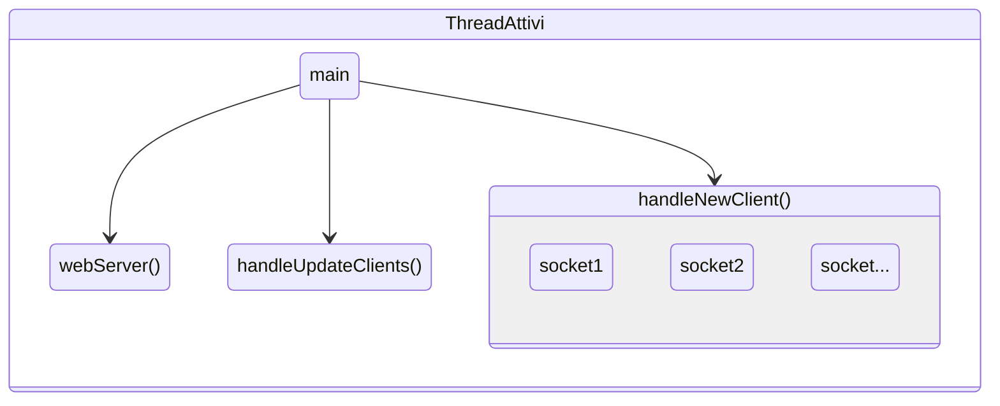
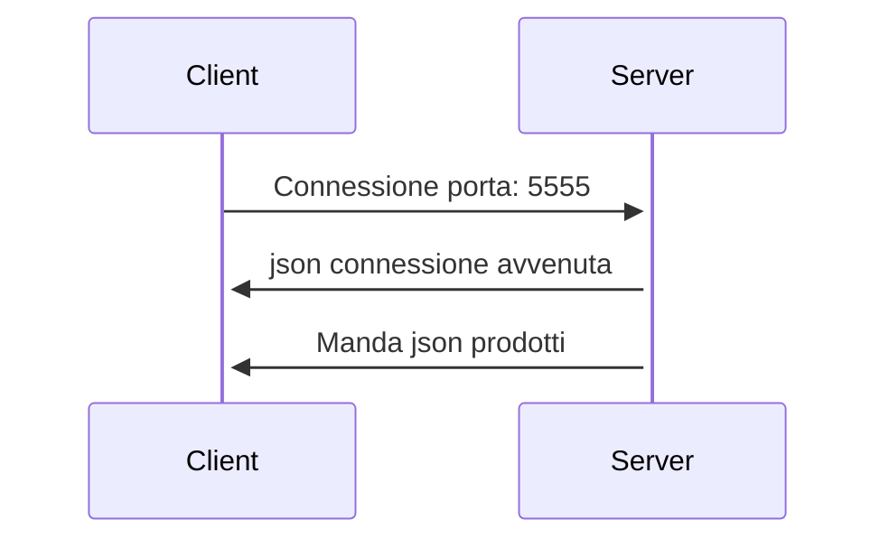
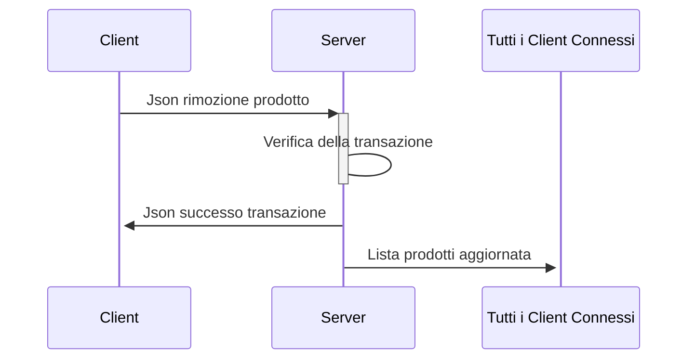

# Progetto per reti di calcolatori
Creato da:
- [Teshale Cella](https://github.com/TTTT-san)
- [Luca Ilari](https://github.com/Luca-Ilari)
  
> [!NOTE]
> Il progetto non è ancora finito quindi alcune funzionalità descritte nel seguito non sono ancora presenti.
# Descrizione
Il progetto consiste in un server multi-threaded che gestisce parallelamente le connessioni e le richieste dei client.

Tutti i messaggi che il server e il client si scambiano sono in formato json con dentro un codice che identifica il tipo di messaggio che si sta mandando. Per dettagli ulteriori andare alla sezione [Json](#json-e-codici-di-stato).

Il server ha una lista di prodotti con le loro proprietà (nome, prezzo, quantità) che manda a tutti i client che si connettono.

I client una volta che sono connessi e hanno ricevuto la lista dei prodotti, possono iniziare ad inviare delle richieste  di "acquisto" al server; ovvero possono mandare una richiesta al server di decrementare un elemento specifico come se lo avessero acquistato.

Il server una volta ricevuta la richiesta verifica la sua validità e quindi decrementa il prodotto specificato dal client.

Ogni volta che un client connesso al server modifica la lista dei prodotti, il server manda la lista aggiornata a tutti i client connessi in modo da avere sempre i client aggiornati.

Se la richiesta non è valida, quindi per esempio il client chiede di rimuovere troppi prodotti rispetto a quelli che ci sono nella lista, il server risponde al client con un json con codiceStato -2.

## Caratteristiche Server
Il server è un'applicazione da linea di comando. Quando viene avviata bisogna specificare la porta su cui il server ascolta nuove connessioni.
Se la porta non è specificata il server non si avvia.

Il server può essere compilato sia per windows che per linux; infatti negli esempi che dopo verranno illustrati, il server è fatto girare su una vps Ubuntu.

Per caricare la lista dei prodotti il server legge un file di testo nella stessa cartella del server.
Inoltre il server ha un limite di client connessi contemporaneamente. Questa variabile è impostata a 20.  

Qui di seguito, una rappresentazione grafica dei thread che il server utilizza per gestire i client e aggiornare la lista dei prodotti quando viene modificata da un client


# Caratteristiche del Client
Il client è stato sviluppato in Java, facendo ampio uso della libreria Swing per l'interfaccia utente e aderendo al pattern architetturale MVC (Model-View-Controller).

Nota: *Assicurati di essere connesso al server prima di utilizzare queste funzionalità*
#### Visualizzazione dei Prodotti
Una volta connesso al server, sia il client Consumer che il client Producer consentono agli utenti di visualizzare i prodotti del negozio forniti dal server nella tabella "Prodotti Negozio". 
Entrambi i client dispongono di un pulsante "switch user" per passare tra le interfacce utente Consumer e Producer.


## Interfaccia Utente - Consumer
Il Consumer ha la possibilità di:

### Acquisto di Prodotti:

1. **Premi il pulsante "compra"** per avviare il processo di acquisto.
2. Il sistema genera automaticamente transazioni con ID prodotto e quantità casuali.
3. Le transazioni vengono inviate al server per l'acquisto.
4. Le transazioni effettuate sono visualizzate nella tabella "Transazioni Acquisite".
5. Il server potrebbe respingere l'operazione se non ci sono abbastanza prodotti disponibili.
6. Una barra di progresso monitora la quantità massima di prodotti che possono essere acquistati.

### Richiesta di Rimborso dei Prodotti:

1. **Premi il pulsante "rimborso"** per avviare il processo di rimborso.
2. Il sistema genera automaticamente transazioni per i prodotti precedentemente acquistati, utilizzando ID e quantità casuali.
3. Le transazioni di rimborso sono inviate al server.
4. Le transazioni di rimborso sono visualizzate nella tabella "Transazioni Rimborsi".
5. Il server potrebbe respingere l'operazione se non ci sono abbastanza prodotti disponibili per il rimborso.
6. Una barra di progresso monitora la quantità massima di prodotti che possono essere restituiti.

## Interfaccia Utente - Producer

### Invio Prodotto:

1. **Compila il modulo** disponibile nell'interfaccia Producer.
2. Specifica l'ID del prodotto, il nome del prodotto oppure seleziona direttamente dalla tabella "Prodotti Negozio" la riga corrispondente al prodotto desiderato.
3. Inserisci la quantità desiderata per ogni transazione e specifica il numero totale di transazioni da effettuare.
4. **Premi il pulsante "invio"** per avviare il processo di invio delle transazioni al server.
5. Una barra di progresso indica la progressione delle transazioni inviate al server.
6. Assicurati di essere connesso al server prima di inviare le transazioni.

**Nota:** Controlla attentamente i dettagli inseriti nel modulo prima di premere il pulsante "invio".


# Esempi di come il client e il server comunicano
Connessione di un client al server sulla porta 5555

Modifica della lista prodotti da parte di un client


# JSON e codici di stato
| codiceStato | Descrizione |
| ----- | ------------- |
| 1 | START_SESSION |
| 2 | RIMUOVI_PRODOTTO |
| 3 | AGGIUNGI_PRODOTTO |
| 4 | LISTA_PRODOTTI_AGGIORNATO |
| 5 | SUCCESSO_TRANSAZIONE_ACQUISTO |
| 6 | SUCCESSO_TRANSAZIONE_VENDITA |
| -1 | FAIL_SESSION |
| -2 | FAIL_RIMUOVI_PRODOTTO |
| -3 | FAIL_AGGIUNGI_PRODOTTO |

## Esempi di json
### Json base
```json
{
   "codiceStato": <codiceStato>,
   ...
}
```
### Aggiornamento lista prodotti
Il server manda ai client questo json quando la lista dei prodotti deve essere aggiornata
```json
{
   "codiceStato":4,
   "prodotti":[
      {
         "id":0,
         "nome":"Pane",
         "prezzo":1.05,
         "quantitaDisponibile":96
      },
      {
        .... 
      }
   ]
}
```
### Json rimozione prodotto
Richiesta da parte di un client per la rimozione di un prodotto 
```json
{
   "codiceStato":2,
   "transazione":{
      "idTransazione":20,
      "idProdotto":1,
      "quantita":4
   }
}
```
### Json successo transazione di acquisto
```json
{
   "codiceStato":5,
   "idTransazione":1
}
```
### Json successo transazione di vendita
```json
{
   "codiceStato":6,
   "idTransazione":1
}
```
