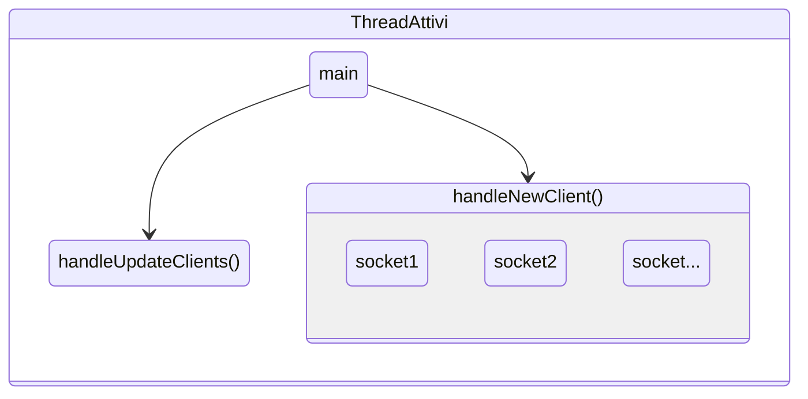
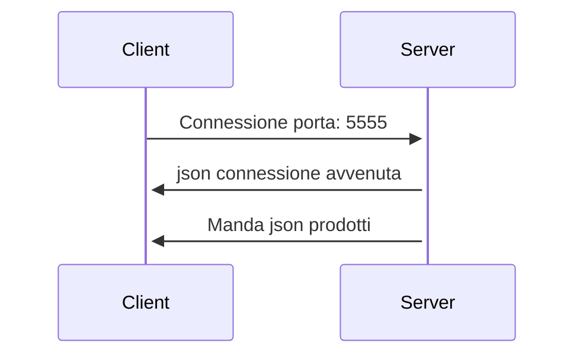
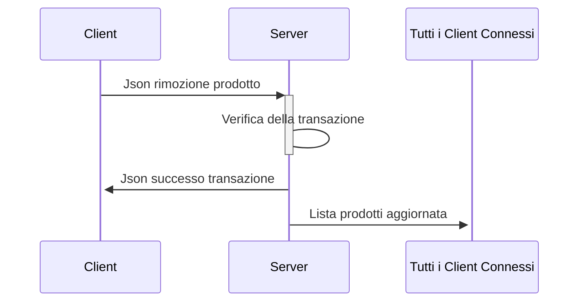

# Progetto per reti di calcolatori
Creato da:
- [Teshale Cella](https://github.com/TTTT-san)
- [Luca Ilari](https://github.com/Luca-Ilari)
  
> [!NOTE]
> Il progetto non è ancora finito quindi alcune funzionalità descritte nel seguito non sono ancora presenti.
# Descrizione
Il progetto consiste in un server multi-threaded che gestisce parallelamente le connessioni e le richieste dei client.

Tutti i messaggi che il server e il client si scambiano sono in formato json con dentro un codice che identifica il tipo di messaggio che si sta mandando. Per dettagli ulteriori andare alla sezione [Json](#json-e-codici-di-stato).

Il server ha una lista di prodotti con le loro proprietà (nome, prezzo, quantità) che manda a tutti i client che si connettono.

I client una volta che sono connessi e hanno ricevuto la lista dei prodotti, possono iniziare ad inviare delle richieste  di "acquisto" al server; ovvero possono mandare una richiesta al server di decrementare un elemento specifico come se lo avessero acquistato.

Il server una volta ricevuta la richiesta verifica la sua validità e quindi decrementa il prodotto specificato dal client.

Ogni volta che un client connesso al server modifica la lista dei prodotti, il server manda la lista aggiornata a tutti i client connessi in modo da avere sempre i client aggiornati.

Se la richiesta non è valida, quindi per esempio il client chiede di rimuovere troppi prodotti rispetto a quelli che ci sono nella lista, il server risponde al client con un json con codiceStato -2.

## Caratteristiche Server
Il server è un'applicazione da linea di comando. Quando viene avviata bisogna specificare la porta su cui il server ascolta nuove connessioni.
Se la porta non è specificata il server non si avvia.

Il server può essere compilato sia per windows che per linux; infatti negli esempi che dopo verranno illustrati, il server è fatto girare su una vps Ubuntu.

Per caricare la lista dei prodotti il server legge un file di testo nella stessa cartella del server.
Inoltre il server ha un limite di client connessi contemporaneamente. Questa variabile è impostata a 20.  

Qui di seguito, una rappresentazione grafica dei thread che il server utilizza per gestire i client e aggiornare la lista dei prodotti quando viene modificata da un client


## Caratteristiche Client
I client sono scritti in java e sono due:
### Producer
Il client producer, una volta connesso al server, aggiunge dei prodotti alla lista del server tramite una richiesta.
I prodotti che il client può aggiungere possono essere creati dall'utente, specificando nome e prezzo, oppure utilizzando uno dei prodotti nella lista del server.
### Consumer
Il client consumer rimuove randomicamente dei prodotti dalla lista del server. Questa operazione può anche essere rifiutata dal server in caso non ci siano abbastanza prodotti.

# Esempi di come il client e il server comunicano
Connessione di un client al server sulla porta 5555

Modifica della lista prodotti da parte di un client


# JSON e codici di stato
| codiceStato | Descrizione |
| ----- | ------------- |
| 1 | START_SESSION |
| 2 | RIMUOVI_PRODOTTO |
| 3 | AGGIUNGI_PRODOTTO |
| 4 | LISTA_PRODOTTI_AGGIORNATO |
| 5 | SUCCESSO_TRANSAZIONE |
| -1 | FAIL_SESSION |
| -2 | FAIL_RIMUOVI_PRODOTTO |
| -3 | FAIL_AGGIUNGI_PRODOTTO |

## Esempi di json
### Json base
```json
{
   "codiceStato": <codiceStato>,
   ...
}
```
### Aggiornamento lista prodotti
Il server manda ai client questo json quando la lista dei prodotti deve essere aggiornata
```json
{
   "codiceStato":4,
   "prodotti":[
      {
         "Id":0,
         "nome":"Pane",
         "prezzo":1.05,
         "quantitaDisponibile":96
      },
      {
        .... 
      }
   ]
}
```
### Json rimozione prodotto
Richiesta da parte di un client per la rimozione di un prodotto 
```json
{
   "codiceStato":2,
   "transazione":{
      "idTransazione":20,
      "idProdotto":1,
      "quantita":4
   }
}
```
### Json successo transazione
```json
{
   "codiceStato":5,
   "idTransazione":1
}
```
